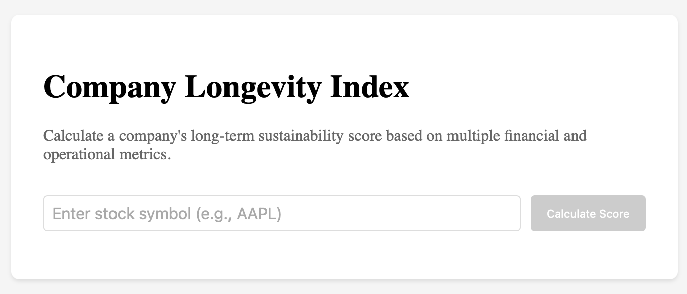

# Company Longevity Index Calculator

A sophisticated tool that calculates a company's long-term sustainability and resilience score based on multiple financial and operational metrics. This project uses real-time financial data to generate a comprehensive longevity index ranging from 0 to 100.



## Features

- Real-time calculation of company longevity scores
- Comprehensive analysis of six key components:
  - Financial Health (30%)
  - Market Position (20%)
  - Operational Efficiency (15%)
  - Corporate Structure (15%)
  - Innovation & Adaptability (10%)
  - Governance & Risk (10%)
- Interactive UI with real-time feedback
- Detailed breakdown of component scores
- Visual representation of scores with progress bars
- Integration with Financial Modeling Prep API for real market data

## Getting Started

### Prerequisites

- React 18+
- Python 3.8+
- Financial Modeling Prep API key

### Installation

1. Clone the repository:

```bash
git clone https://github.com/veerdosi/longevity-index.git
cd longevity
```

2. Install frontend dependencies:

```bash
npm install
```

3. Install backend dependencies:

```bash
pip install -r requirements.txt
```

4. Create a `.env` file in the root directory and add your API key:

```env
FINANCIAL_API_KEY=your_api_key_here
```

### Development

1. Start the backend server:

```bash
cd api
python calculate.py
```

2. In a new terminal, start the frontend development server:

```bash
npm run dev
```

3. Open [http://localhost:3000](http://localhost:3000) in your browser.

## Deployment

This project is configured for deployment on Vercel. To deploy:

1. Fork this repository
2. Connect your fork to Vercel
3. Add your `FINANCIAL_API_KEY` in Vercel's Environment Variables
4. Deploy!

## Methodology

The longevity index is calculated using a weighted average of six key components:

1. **Financial Health (30%)**

   - Current Ratio
   - Debt-to-Equity
   - Interest Coverage
   - Operating Cash Flow
   - Profit Margin
   - Revenue Growth

2. **Market Position (20%)**

   - Market Share
   - Brand Value
   - Customer Retention
   - Geographic Diversity

3. **Operational Efficiency (15%)**

   - Asset Turnover
   - Inventory Turnover
   - Employee Productivity
   - Operating Margin

4. **Corporate Structure (15%)**

   - Subsidiary Health
   - Organizational Complexity
   - Parent Company Support
   - Group Synergy

5. **Innovation & Adaptability (10%)**

   - R&D Intensity
   - Digital Transformation
   - Patent Portfolio
   - New Product Revenue

6. **Governance & Risk (10%)**
   - Board Independence
   - Regulatory Compliance
   - Risk Management
   - Succession Planning

## API Reference

### Calculate Longevity Score

```http
POST /api/calculate
```

Request body:

```json
{
  "symbol": "AAPL"
}
```

Response:

```json
{
  "score": 85.4,
  "components": {
    "financial_health": 90.2,
    "market_position": 88.5,
    "operational_efficiency": 82.3,
    "corporate_structure": 78.9,
    "innovation_adaptability": 92.1,
    "governance_risk": 85.6
  }
}
```

## Contributing

Contributions are welcome! Please feel free to submit a Pull Request. For major changes, please open an issue first to discuss what you would like to change.

## License

This project is licensed under the MIT License - see the [LICENSE](LICENSE) file for details.

## Acknowledgments

- Financial data provided by [Financial Modeling Prep](https://financialmodelingprep.com/)
- UI components from [shadcn/ui](https://ui.shadcn.com/)
- Icons from [Lucide](https://lucide.dev/)

## Contact

Your Name - [@veerdosi](https://twitter.com/veerdosi)
